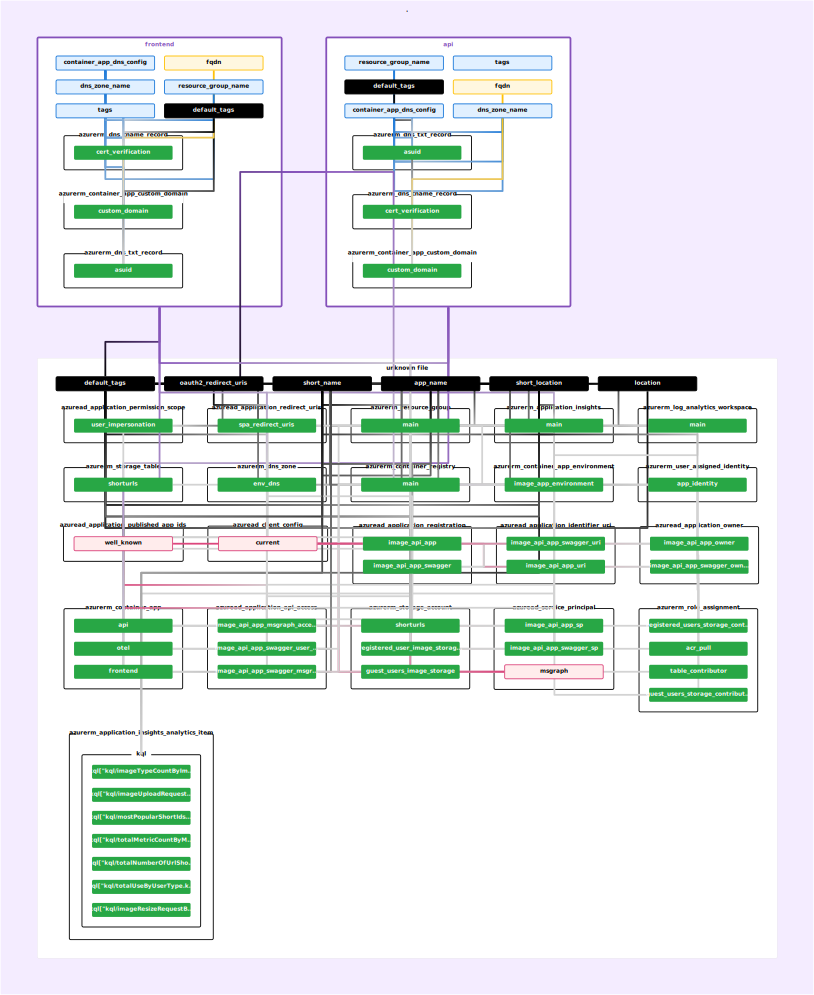

# Infrastructure

The infrastructure directory contains the Terraform configuration for provisioning the Entra ID and Azure Cloud resources for hosting the image app.

## 1. Prerequisites

The Terraform configuration requires,

1. The backend configuration for the environment to store the state file, the following fields are required, the resource group, storage account and the container specified in the backend file must exist and will not automatically be created by Terraform.

```tfvars
# E.g. dev.backend.tfvars

resource_group_name  = "<RESOURCE_GROUP_NAME>"
storage_account_name = "<STORAGE_ACCOUNT_NAME>"
container_name       = "<CONTAINER_NAME>"
key                  = "terraform.tfstate"
```

2. The environment specific variables for the configuration

```tfvars
# E.g. dev.tfvars

env             = "dev"
tenant_id       = "<TENANT_ID>"
subscription_id = "<SUBSCRIPTION_ID>"
source_acr_server_name="<SOURCE_ACR_SERVER_NAME>"
```

3. The Azure Container Registry provisioned by this module makes available three images to the Azure Container Apps instances,
   1. frontend:latest
   2. image-api-app:latest
   3. otel-col:latest

These images are copied over from the provided source Azure Container Registry to the Azure Container Registry provisioned by this terraform module.

## 2. Commands

Given below are the commands to provision the infrastructure,

1. Initialise the terraform configuration

```bash
terraform init -backend-config=dev.backend.tfvars
```

2. Create and save the plan in the file

```bash
terraform plan --var-file=dev.tfvars --out=dev.tfplan
```

3. Apply the changes in the plan file to provision the environment

```bash
terraform apply dev.tfplan
```

## 3. Rover graph for the terraform configuration



## 4. Updating the Terraform module docs

```bash
terraform-docs -c .terraform-docs.yaml .
```

## 5. Destroying the environment

1. Initialise the terraform configuration

```bash
terraform init -backend-config=dev.backend.tfvars
```

2. Create and save the plan in the file to destroy

```bash
terraform plan --var-file=dev.tfvars --out=dev.tfplan --destroy
```

3. Apply the changes in the plan file to provision the environment

```bash
terraform apply dev.tfplan
```

<!-- BEGIN_TF_DOCS -->

# Module documentation
Below is the documentation for the terraform generated using Terraform-docs.

## Requirements

| Name | Version |
|------|---------|
| <a name="requirement_terraform"></a> [terraform](#requirement\_terraform) | 1.9.5 |
| <a name="requirement_azuread"></a> [azuread](#requirement\_azuread) | 3.0.2 |
| <a name="requirement_azurerm"></a> [azurerm](#requirement\_azurerm) | =4.2.0 |
## Providers

| Name | Version |
|------|---------|
| <a name="provider_azuread"></a> [azuread](#provider\_azuread) | 3.0.2 |
| <a name="provider_azurerm"></a> [azurerm](#provider\_azurerm) | 4.2.0 |
## Resources

| Name | Type |
|------|------|
| [azuread_application_api_access.image_api_app_msgraph_access](https://registry.terraform.io/providers/hashicorp/azuread/3.0.2/docs/resources/application_api_access) | resource |
| [azuread_application_api_access.image_api_app_swagger_msgraph_access](https://registry.terraform.io/providers/hashicorp/azuread/3.0.2/docs/resources/application_api_access) | resource |
| [azuread_application_api_access.image_api_app_swagger_user_impersonation_access](https://registry.terraform.io/providers/hashicorp/azuread/3.0.2/docs/resources/application_api_access) | resource |
| [azuread_application_identifier_uri.image_api_app_swagger_uri](https://registry.terraform.io/providers/hashicorp/azuread/3.0.2/docs/resources/application_identifier_uri) | resource |
| [azuread_application_identifier_uri.image_api_app_uri](https://registry.terraform.io/providers/hashicorp/azuread/3.0.2/docs/resources/application_identifier_uri) | resource |
| [azuread_application_owner.image_api_app_owner](https://registry.terraform.io/providers/hashicorp/azuread/3.0.2/docs/resources/application_owner) | resource |
| [azuread_application_owner.image_api_app_swagger_owner](https://registry.terraform.io/providers/hashicorp/azuread/3.0.2/docs/resources/application_owner) | resource |
| [azuread_application_permission_scope.user_impersonation](https://registry.terraform.io/providers/hashicorp/azuread/3.0.2/docs/resources/application_permission_scope) | resource |
| [azuread_application_redirect_uris.spa_redirect_uris](https://registry.terraform.io/providers/hashicorp/azuread/3.0.2/docs/resources/application_redirect_uris) | resource |
| [azuread_application_registration.image_api_app](https://registry.terraform.io/providers/hashicorp/azuread/3.0.2/docs/resources/application_registration) | resource |
| [azuread_application_registration.image_api_app_swagger](https://registry.terraform.io/providers/hashicorp/azuread/3.0.2/docs/resources/application_registration) | resource |
| [azuread_service_principal.image_api_app_sp](https://registry.terraform.io/providers/hashicorp/azuread/3.0.2/docs/resources/service_principal) | resource |
| [azuread_service_principal.image_api_app_swagger_sp](https://registry.terraform.io/providers/hashicorp/azuread/3.0.2/docs/resources/service_principal) | resource |
| [azurerm_application_insights.main](https://registry.terraform.io/providers/hashicorp/azurerm/4.2.0/docs/resources/application_insights) | resource |
| [azurerm_application_insights_analytics_item.kql](https://registry.terraform.io/providers/hashicorp/azurerm/4.2.0/docs/resources/application_insights_analytics_item) | resource |
| [azurerm_container_app.api](https://registry.terraform.io/providers/hashicorp/azurerm/4.2.0/docs/resources/container_app) | resource |
| [azurerm_container_app.frontend](https://registry.terraform.io/providers/hashicorp/azurerm/4.2.0/docs/resources/container_app) | resource |
| [azurerm_container_app.otel](https://registry.terraform.io/providers/hashicorp/azurerm/4.2.0/docs/resources/container_app) | resource |
| [azurerm_container_app_environment.image_app_environment](https://registry.terraform.io/providers/hashicorp/azurerm/4.2.0/docs/resources/container_app_environment) | resource |
| [azurerm_container_registry.main](https://registry.terraform.io/providers/hashicorp/azurerm/4.2.0/docs/resources/container_registry) | resource |
| [azurerm_log_analytics_workspace.main](https://registry.terraform.io/providers/hashicorp/azurerm/4.2.0/docs/resources/log_analytics_workspace) | resource |
| [azurerm_resource_group.main](https://registry.terraform.io/providers/hashicorp/azurerm/4.2.0/docs/resources/resource_group) | resource |
| [azurerm_role_assignment.acr_pull](https://registry.terraform.io/providers/hashicorp/azurerm/4.2.0/docs/resources/role_assignment) | resource |
| [azurerm_role_assignment.guest_users_storage_contributor](https://registry.terraform.io/providers/hashicorp/azurerm/4.2.0/docs/resources/role_assignment) | resource |
| [azurerm_role_assignment.registered_users_storage_contributor](https://registry.terraform.io/providers/hashicorp/azurerm/4.2.0/docs/resources/role_assignment) | resource |
| [azurerm_role_assignment.table_contributor](https://registry.terraform.io/providers/hashicorp/azurerm/4.2.0/docs/resources/role_assignment) | resource |
| [azurerm_storage_account.guest_users_image_storage](https://registry.terraform.io/providers/hashicorp/azurerm/4.2.0/docs/resources/storage_account) | resource |
| [azurerm_storage_account.registered_user_image_storage](https://registry.terraform.io/providers/hashicorp/azurerm/4.2.0/docs/resources/storage_account) | resource |
| [azurerm_storage_account.shorturls](https://registry.terraform.io/providers/hashicorp/azurerm/4.2.0/docs/resources/storage_account) | resource |
| [azurerm_storage_table.shorturls](https://registry.terraform.io/providers/hashicorp/azurerm/4.2.0/docs/resources/storage_table) | resource |
| [azurerm_user_assigned_identity.app_identity](https://registry.terraform.io/providers/hashicorp/azurerm/4.2.0/docs/resources/user_assigned_identity) | resource |
| [azuread_application_published_app_ids.well_known](https://registry.terraform.io/providers/hashicorp/azuread/3.0.2/docs/data-sources/application_published_app_ids) | data source |
| [azuread_client_config.current](https://registry.terraform.io/providers/hashicorp/azuread/3.0.2/docs/data-sources/client_config) | data source |
| [azuread_service_principal.msgraph](https://registry.terraform.io/providers/hashicorp/azuread/3.0.2/docs/data-sources/service_principal) | data source |
## Inputs

| Name | Description | Type | Default | Required |
|------|-------------|------|---------|:--------:|
| <a name="input_env"></a> [env](#input\_env) | The environment name to use for the deployment | `string` | n/a | yes |
| <a name="input_source_acr_server_name"></a> [source\_acr\_server\_name](#input\_source\_acr\_server\_name) | The Azure Container Registry to use as the source to copy the images from to the ACR in the target environment | `string` | n/a | yes |
| <a name="input_subscription_id"></a> [subscription\_id](#input\_subscription\_id) | The Azure subscription ID | `string` | n/a | yes |
| <a name="input_tenant_id"></a> [tenant\_id](#input\_tenant\_id) | The Azure tenant ID | `string` | n/a | yes |
## Outputs

| Name | Description |
|------|-------------|
| <a name="output_app_client_id"></a> [app\_client\_id](#output\_app\_client\_id) | The client ID for the application |
| <a name="output_frontend_url"></a> [frontend\_url](#output\_frontend\_url) | The URL for the frontend |
| <a name="output_swagger_client_id"></a> [swagger\_client\_id](#output\_swagger\_client\_id) | The client ID for the Swagger application |
| <a name="output_swagger_url"></a> [swagger\_url](#output\_swagger\_url) | The URL for the Swagger documentation |
<!-- END_TF_DOCS -->
